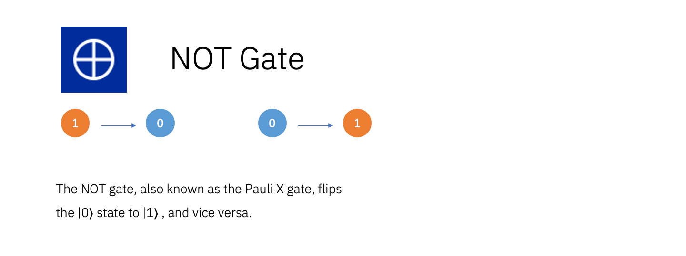

# Description of the Quantum Gates 

"Quantum Gates" are the fundamental operations that can be applied to Qubits.  
The three most important Quantum gates are NOT, CNOT and H.  
For more details see [Operations glossary](https://quantum-computing.ibm.com/composer/docs/iqx/operations_glossary).

