# Setup instructions for the QoffeeMaker

> [Credentials (IBM internal)](https://ibm.box.com/s/wbe3ea8rxpea7ou7vwbhhbwct4vcket1)

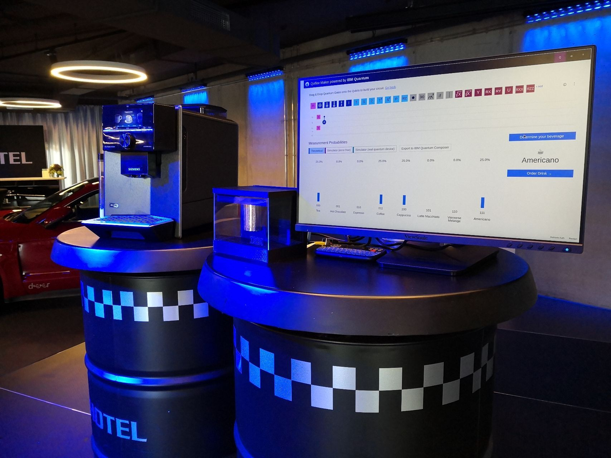

Some stats for the setup:

- List of parts:
  -  [RasQberry](https://rasqberry.org/) (Raspberry Pi in enclosure)
     -  Cables: Power Adapter <-> USB-C, USB-C <-> USB-C
      > 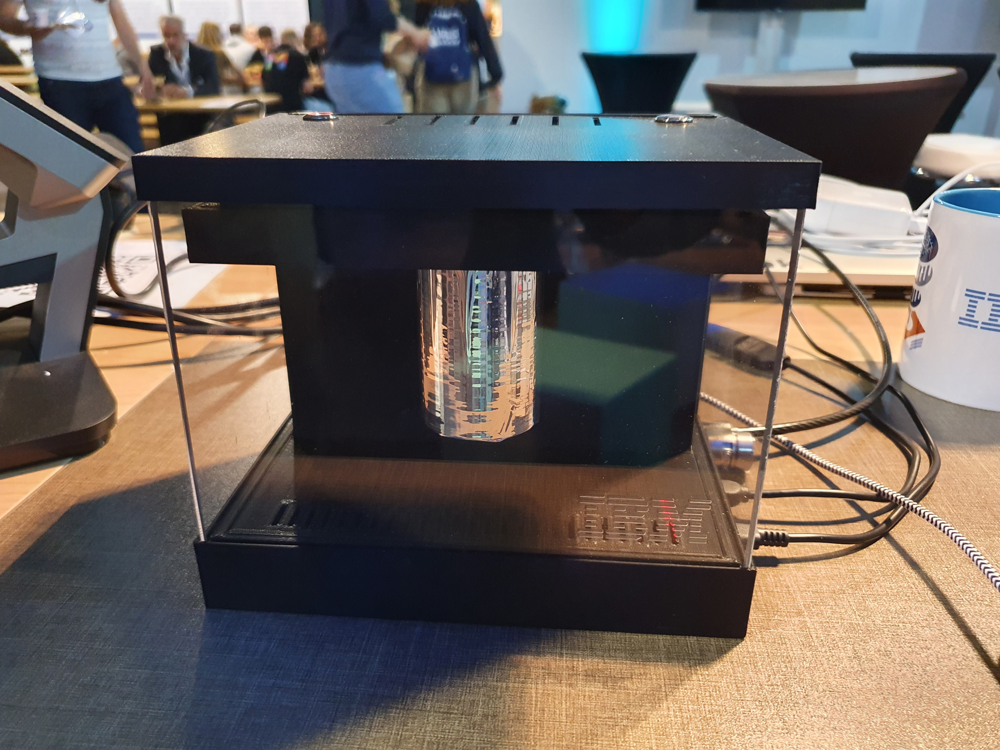
  -  Small keyboard for RasQberry 
     -  USB receiver for connection to RasQberry should already be plugged in (Attention: The cable in the picture is for charging the keyboard!)
      > 
  -  Coffee Machine (Siemens Bosch Hausgeräte)
  -  Touchscreen Display (Viewsonic)
     -  Cables: HDMI <-> Mini-HDMI, power cable
  -  Router (Little white box)
     -  Cables: LAN cable, power cable
  -  Tableware:
     -  Cups
     -  Bins (one for fluids, one for solids)
  -  Consumables: 
     -  Coffee beans (Crema, Espresso)
     -  Milk (normal, lactose free, oat-drink)
     -  Hot chocolate (bags for one cup)
     -  Tea
     -  Water (for the coffee machines tank)
     -  Cleaning tabs for the coffee machine

- Dimensions: Breadth: 1.5-2m, Depth: 0.8m, Heigth: 1.2m
- Power: minimum 4 power outlets; total about 1600W (~ 7A, 230V)
- Internet: Ethernet or WI-FI Connection to the Internet is neccessary; Network should be allowing repeaters/access points; Hotspots via your mobile phone are also possible

1. Build up the different parts independently (coffee machine, RasQberry, touchscreen monitor, Router) and connect them to a power outlet (total: 1600W (~ 7A, 230V))
> 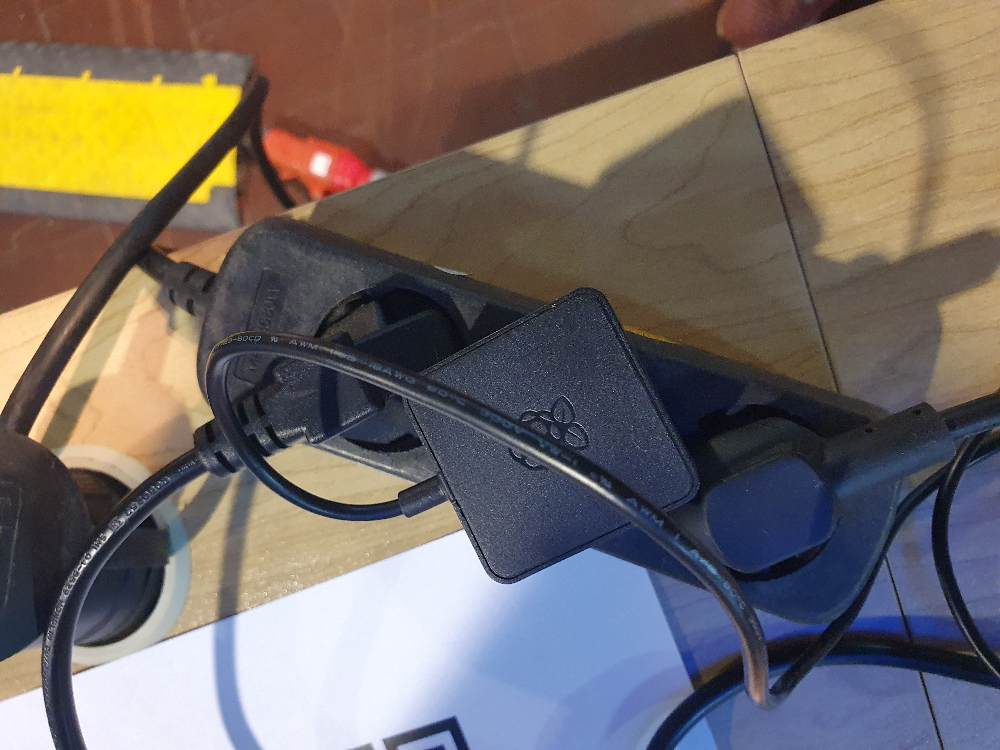
2. Connect the Display and the RasQberry by cables (HDMI cable, USB cable)
> 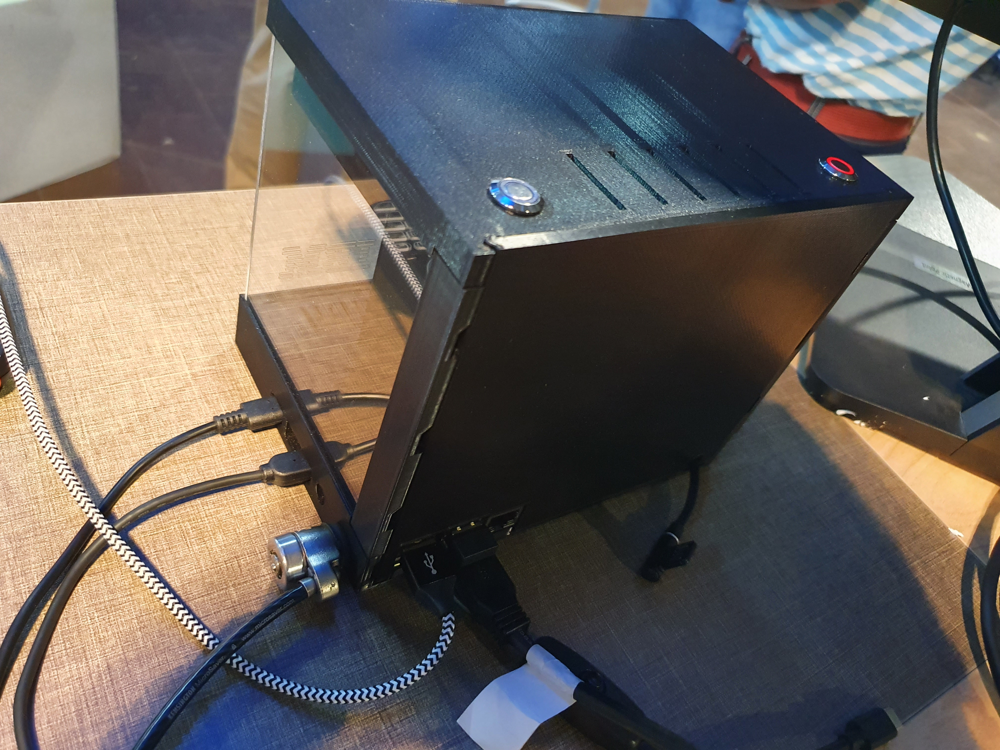
> 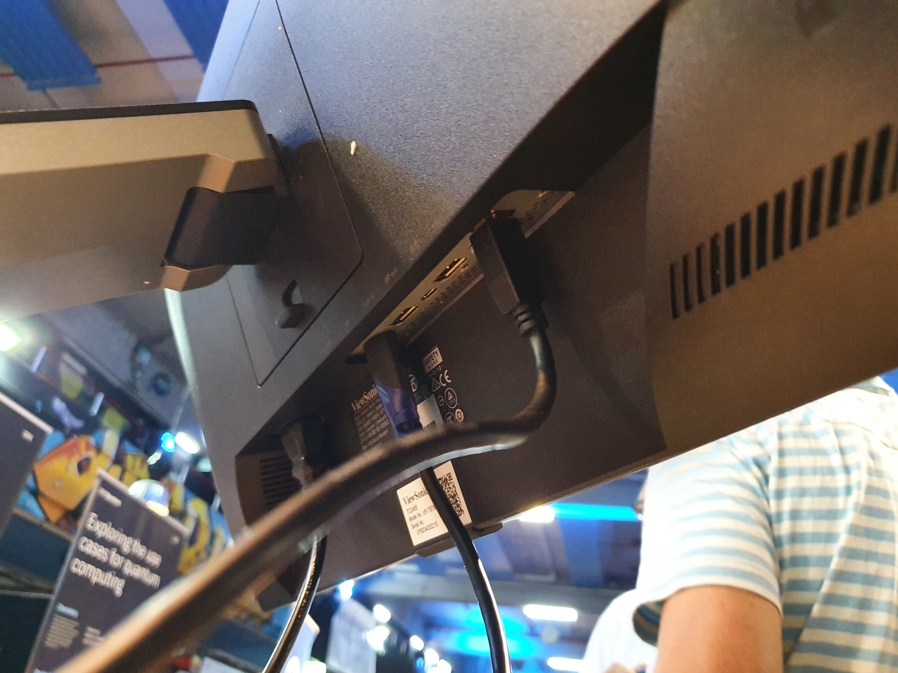
3. Power on all devices (coffee machine, touchscreen monitor); the other devices are powered on automatically

## Router 

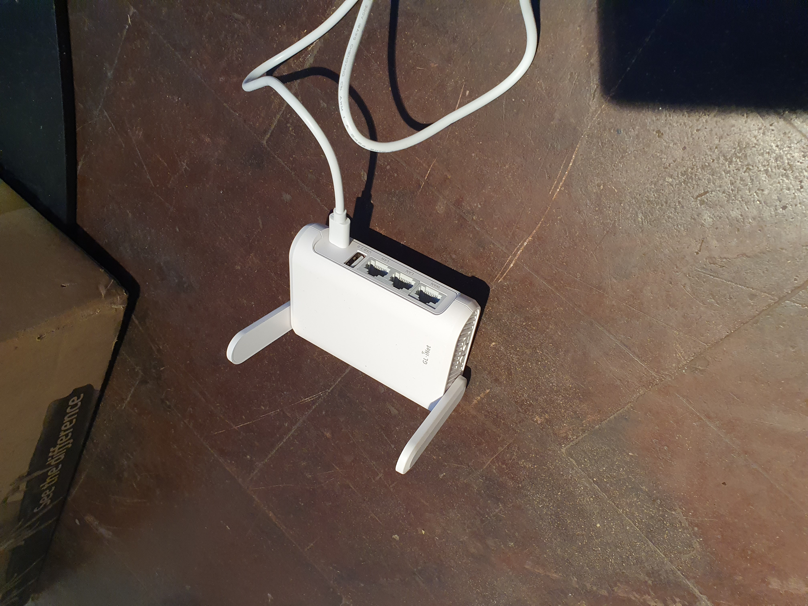

1. After some minutes you should find a WI-FI network called *Qoffee*. Connect to this network on your laptop or mobile device with the credentials.
2. Don't worry: The router is probably **not** connected to the internet. We will change this now.
3. Open: 192.168.8.1 in your browser and log in with the credentials.

> You want to use WI-FI to connect the router to the internet:
> 1. Scroll down on the page
> 2. Click repeater
> 3. Configure the WI-FI network to repeat

> You want to use ethernet to connect to the internet:
> 1. Plug in the ethernet-cable

4. Check if the connection works (You can do this by checking if the device you are using right now, is now connected to the internet.)

## Qoffee Machine

1. Fill in all consumables: coffee beans(on top of machine), milk (left, see picture below), water (right, see picture below)
>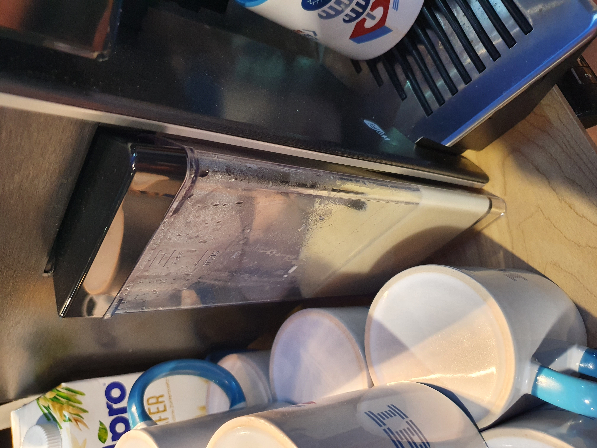
>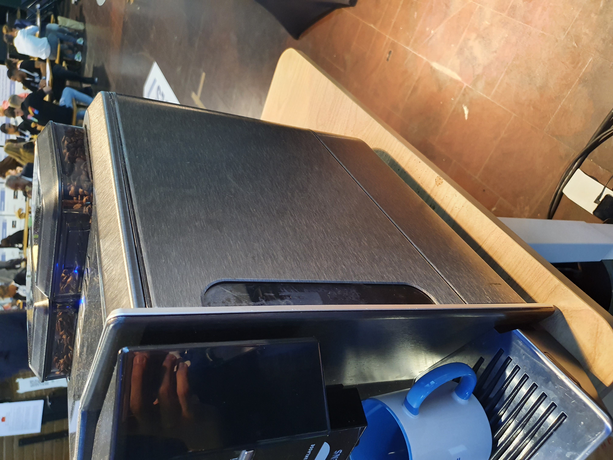
2. After the startup you should see a screen like this: 

>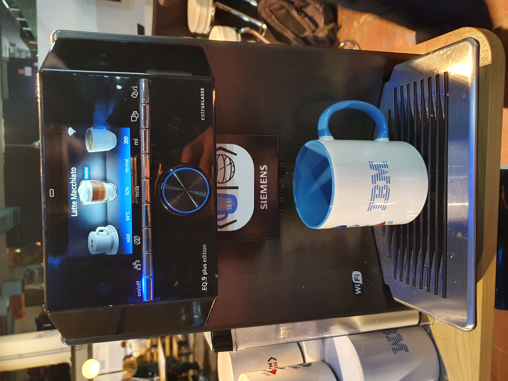
If you dont see this, you probably have to clean the machine or do maintenance. You can find intructions on how to deal with these issues [here](https://www.siemens-home.bsh-group.com/de/kundendienst/pflege-reinigung/kaffeemaschinen).

2. Check if the machine is connected to the wireless network. The router should obviously be powered on for this. If the machine is connected there should be a WI-FI symbol in the top right hand corner. (see picture for example)
3. If neccessary change the configuration for the different beverages (cup size in ml, amount of coffee vs milk, etc.)

## RasQberry
1. Wait until the RasQberry has booted. It is finished if you see multiple desktop icons and an IBM-themed background.
2. Control the RasQberry by using the small keyboard or by using the touchscreen (keyboard is recommended).
3. Check for a working network connection. Do this by moving the cursor the top of the screen. You should see a WI-FI symbol.
4. Open the QoffeeMaker application by clicking on the desktop icon. There are two icons. Click on the **upper one** once!
5. Wait a few second until the Jupyter notebook screen turns up in the browser.
6. Open the qoffee.ipynb notebook.
7. Wait a few seconds until a little rocket turns up in the menu bar.
   >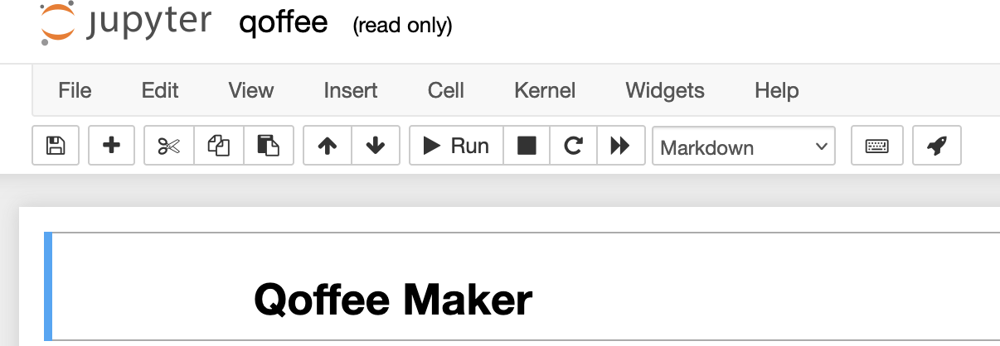
8. Click the rocket to open app mode. The window should now be fullscreen and showing a GUI.
> To reload the whole notebook or reenable fullscreen click the correspoding buttons in the lower right hand corner.
9. In the lower right hand corner click "Refresh Auth". If the button turns green go on with the instructions. 
> 1. Otherwise you should see a popup saying "Invalid Authentication". Click OK and you will be redirected to a login page in a new tab.
> 2. Click "Home Connect" and login with the credentials. 
> 3. You can close the tab now.
> 4. Try clicking on "Refresh Auth" again. 
> 5. Now it should turn green.

10. Try out the circuit composer, determine your beverage and order it. If everything works fine there should now be a hot drink in your cup!

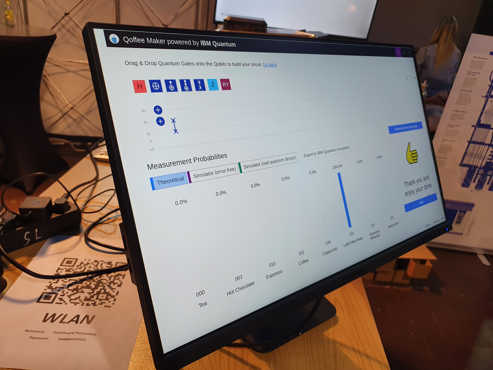

---

# Usage tips

- By clicking on "Simulator (error free)" and "Simulator (real quantum device)" you can calculate these models too. Wait a few seconds for them to show up in the graphs below. The colors indicate which model is which.
- The circuit can be exported to the IBM Quantum composer by clicking on "Export to IBM Quantum Composer".
- By default the circuit is always run in with an error-free simulator. Change this by clicking on the "Q" in the top right hand corner. It should change its colors between purple (error-free) and green (simulating a real device). 
- You can show more gates in the composer by clicking the crossed out eye on the right side of the screen.
- To reload the whole notebook or reenable fullscreen click the correspoding buttons in the lower right hand corner.
   > 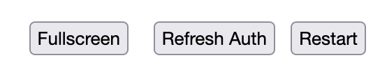
- The RasQberry has inbuilt LEDs which can be acitvated by pressing the **right** button on top of the enclosure for about 4 seconds. The activation takes a short time.
- The RasQberry can be turned off by pressing the **left** button on the top the enclosure.
- The menu bar disappears on its own. Therefore you have to move to the mouse to the top of the screen to show the bar again.
- 

---

# Bug fixing

- If there are any problems, the first thing to try is a restart of the Raspberry Pi. To do this, click on the restart symbol in the menu bar at to top of the screen. If the bar is not visible, move your mouse to the top of the screen.
- If there the coffee machine doesnt make the ordered coffee:
  - The machine has to in the selection mode (see picture above; you can choose beverages etc.) to be ready for remote control.
  - Check if the option "Fernstart" is activated in the settings of the coffee machine.
- If there are any problems regarding the notebook (e.g. not starting, multiple instances open) restart the whole Raspberry Pi.
- 