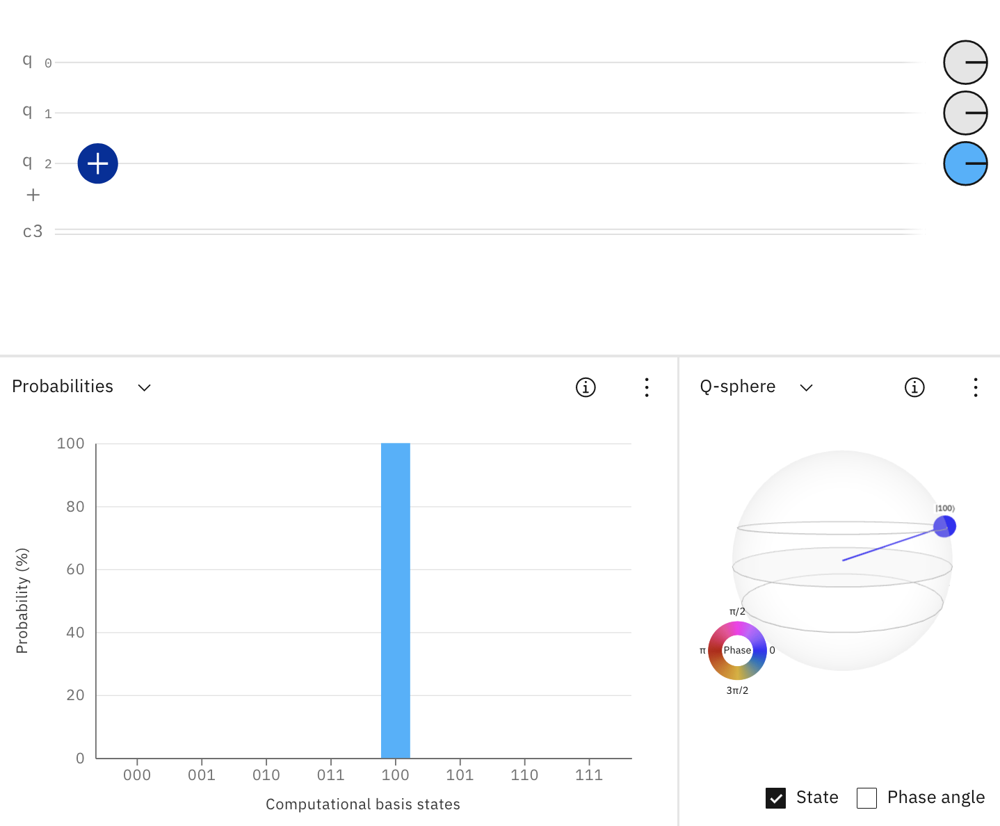

# Welcome to the Qoffee Maker 

## Introduction
Qoffee Maker is based on [Quantum Computing](https://en.wikipedia.org/wiki/Quantum_computing) and will produce a coffee, capuccino, etc based on the measurement result of a Quantum Circuit. 

All you need to do to get your favourite type of coffee is to graphically create a quantum circuit whose measurement result is the binary number of your beverage.

Sounds complicated?  
... Actually it's quite simple. Have at look at the Quick Start and the examples below.

You can try out the examples on the [IBM Quantum Composer](http://quantum-computing.ibm.com/composer), before running it on the real Qoffee Maker.

## Quick Start

### IBM Quantum Composer

Using the IBM Quantum Composer, Quantum Circuits can be build by drag & drop of various gates onto the qubits. The resulting measurement probabilities are shown in a diagram. In addition, the Quantum Circuits can be executed on real quantum hardware or on simulators. A more detailed overview of the IBM Quantum Composer can be found [here](https://quantum-computing.ibm.com/composer/docs/iqx/overview).

 

2 View: customize the layout.

4 Quantum gates and operations bar: Drag and drop gates (i.e. the building blocks of quantum circuits) onto the graphical circuit editor. The qubits are ordered q2, q1, q0, and each are initialized with 0.

6 Graphical circuit editor: this is where you build a circuit. Drag gates and other operations onto the horizontal qubit “wires” that make up your quantum register.

8 Visualizations: characterize your circuit, e.g. visualize the probabilities of the quantum state as you build it.

### Description of the Quantum Gates
"Quantum Gates" are the fundamental operations that can be applied to Qubits.  
The three most important Quantum gates are NOT, CNOT and H.  
For more details see [Operations glossary](https://quantum-computing.ibm.com/composer/docs/iqx/operations_glossary).

### Beverages

Our Qoffee Maker offers eight beverages, which can be mapped to three-digit binary numbers with the canonical mapping 0 -> 000, 1 -> 001, 2 -> 010, ..., 6 -> 110, 7 -> 111.  

## How to obtain your coffee of choice
The following examples illustrate how the standard gates (NOT, CNOT, H) can be used to solve the coffee puzzle.

### I want a Cappucino

To get a cappuccino, which is beverage number 4 (encoded with the binary number 100), you need to build the Quantum Circuit such that the state 100 will come up with 100% probability.  
Remember: The qubits are ordered q2, q1, q0, and each are initialized with 0.  
The simplest way to build the desired "capuccino circuit" is to apply an NOT-Gate to qubit q2, which flips the state from |000> to |100>.  
Try this circuit [here](https://quantum-computing.ibm.com/composer/files/new?initial=N4IgdghgtgpiBcIDCEAOBXAxpglmA9iADQgCOEAzlAiAPIAKAogHICKAggMoCyABAEwA6AAwBuADpg8mADboAJjF7iyMGTgBGARkHSVEsJNIAnGAHNepANoBmALoHMpi5lsPJkgB6Wr-B8RBFCiccVAAXHHwwGhAAXyA).

### No caffein, please

Tea (0, 000) and Hot Chocolate (1, 001) are the only two drinks without caffein. 

To get each of these two drinks with equal probability, you can apply an H-Gate to q0.  
This brings qubit q0 into a superposition of |0> and |1>, such that each state |000> and |001> have a 50% measurement probability.  
Try this circuit [here](https://quantum-computing.ibm.com/composer/files/new?initial=N4IgdghgtgpiBcIByB7ABAYwgM2zAlmADRoAOANjBAM5xEgCONUCIA8gAoCiSAigIIBlALJoATADoADAG4AOmEIZyAVwAmMNHMYxy%2BAEYBGCUu3ywChgCcYAczQMA2gGYAuuYw37GF%2B4UKACwdHKXcQeg1qT3xSABd8FDBWEABfIA).

### I want something to drink, it doesn’t matter what

Applying an H-Gate to all 3 Qubits, brings the whole system into an equal superposition. Thus, the selection of your drink is completely left to chance.  
We hope you enjoy your quantum surprise :). 
Try this circuit [here](https://quantum-computing.ibm.com/composer/files/new?initial=N4IgdghgtgpiBcICSACA7hMAXFBnA9rFgBYCWYA5ilvigCYBO5A1gDQqk534y5iCYBDigQsWGA3TERIViACOEXFAQgA8gAUAogDkAigEEAygFkUAJgB0ABgDcAHTDkAxgBsArnRgo78mC9IARgCMFs4%2B9mAOcgwwVHIA2gDMALoRTjFUTkmpDg7EKAlWOWD5CUHFpfFmqTIgnrjppAAOWKT4YCogAL5AA). 

### I want something with caffein, but not too strong

To let the Quantum Circuit decide between Cappuccino (4, 100) and Latte Macchiato (5, 101), you can apply a NOT-Gate to q2 (i.e. flipping q2 to "1") and an H-Gate to q0.  
Try this circuit [here](https://quantum-computing.ibm.com/composer/files/new?initial=N4IgdghgtgpiBcICSACA7hMAXFBnA9rFgBYCWYA5uqSSgMYQBmjM5ANCgEYCuOY%2BOLPnx4sAJ3yUQbEAEcIuKAhAB5AAoBRAHIBFAIIBlALIoATADoADAG4AOmHJ0ANtwAmMFLbkwnpTgEZzRy87MHtZMRgqWQBtAGYAXVC6SKo6eKT7e2IUWMtMsAAPXJjTJOkQd1wU0gAHLFJJZRAAXyA).

### I want either tea or coffee

To get either a tea (0, 000) or coffee (3, 011) with equal probability, the so-called „Bell State” can be used. It is created by applying an H-Gate to q0 and a CNOT-Gate with q1 as target and q0 as control qubit.  
Try this circuit [here](https://quantum-computing.ibm.com/composer/files/new?initial=N4IgdghgtgpiBcICSACA7hMAXFMCWWAFjAE4pYwQoD2ZAxtQGaMxwA0IAjhAM5QIgA8gAUAogDkAigEEAygFkUAJgB0ABgDcAHTB4wdADYBXACYwUWrjAN4ARgEYVeupe1gdnEjADmKTgG0AZgBdNzovXzog0J0dQj9-NRj9AA8EpLYA%2B1CQDjMecLwAByw8ajABEABfIA).

## Advanced Exercises (optional)
To spice up your beverage selection, you can try to find quantum circuits that solve the following advanced exercises.

### I want an Espresso, but want to apply all single qubit gates to q0 only

To select an Espresso (2, 010), qubit q1 needs to be measured as "1". This can be achieved by using a swap gate, or three CNOT gates as shown in the following solution. (solutions are only provided for the first two of the advanced exercises). 
Try this circuit [here](https://quantum-computing.ibm.com/composer/files/new?initial=N4IgdghgtgpiBcICSACA7hMAXFmUFEBnABwCcZDCB7AGhQCMBXHDbFLK3Y4gGwE9cPHikIBLMAHMeMFAEdG9UTgkQsFdp1kAGFFTD8QNELIiEoCEAHkACvgByARQCCAZQCyKAEwA6LQG4AHTBxAGMeRgATGQDjGB5RegBGb1CYwLAg2XIJOQBtAGYAXXSQ7JQQguKgoIAPPK0qsBC62VyGmlbExua8ro627paB-q6-QxAowlLRYixRPQsQAF8gA).

### I want a normal coffee, but want to use only one single X-Gate (plus the other gates as needed)

To certainly get a normal coffee (3, 011), we need to switch the states of both q0 and q1 from 0 to 1. 
Instead of applying a second NOT gate, you can use the following circuit identity: NOT = H Z H with Z being the Z gate.  
Try this circuit [here](https://quantum-computing.ibm.com/composer/files/new?initial=N4IgdghgtgpiBcICSACA7hMAXFEVgHsAnKCAGxQGMCAzGmGAGhQCMBXHDbFLAlNgM4wUBMGQCeIsMIEBLMAHMywgBoBaAOIQswgBQAHMoJ4ALYQSxmiKBdpgDcD6TAAmrgJQhGIAI4QBUAggAPIACgCiAHIAigCCAMoAsigATAB0AAwA3AA6YPKURm4oOb4wZLIsAIxpBaW5YHk%2BRDAKKD4A2gDMALoNlC1tlN19eXkAHu0dGaNgJlNVswBeC7PznYtZXiBuAgOy%2BliyokEgAL5AA).

### I want a tea or something strong, but I prefer tea

Goal: Tea (0, 000) or Espresso (2, 010) or Coffee (3, 011) or Wiener Melange (6, 110) or Americano (7, 111), but Tea with a higher probability.

### I want something strong, but preferably an Espresso
Goal: Espresso (2, 010) or Wiener Melange (6, 110) or Americano (7, 111) with higher probability for an Espresso than for Wiener Melange and Americano.

### I want something with caffein

Goal: Espresso (2, 010) or Coffee (3, 011) or Cappuccino (4, 100) or Latte Macchiato (5, 101) or Wiener Melange (6, 110) or Americano (7, 111).

### I want either something without caffein or something with much caffein but without milk (CCX Gate)

Goal: Tea (0, 000) or Hot Chocolate (1, 001) or Espresso (2, 010) or Americano (7, 111).

### I want something to drink, it doesn’t matter what, preferably a Coffee, but no Americano

Goal: Tea (0, 000) or Hot Chocolate (1, 001) or Espresso (2, 010) or Coffee (3, 011) or Cappuccino (4, 100) or Latte Macchiato (5, 101) or Wiener Melange (6, 110), Coffee should have the highest probability.

## How to build your own Qoffee Maker at home
An initial code drop is available in this GitHub repo. Code cleanup will follow as well as documentation.  
In any case, you can use the [IBM Quantum Composer](http://quantum-computing.ibm.com/composer) to practice your skills in using fundamental quantum gates and execute quantum circuits on real quantum computers.

