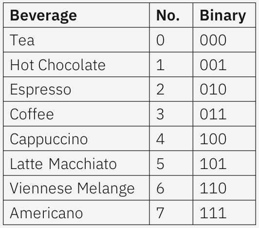
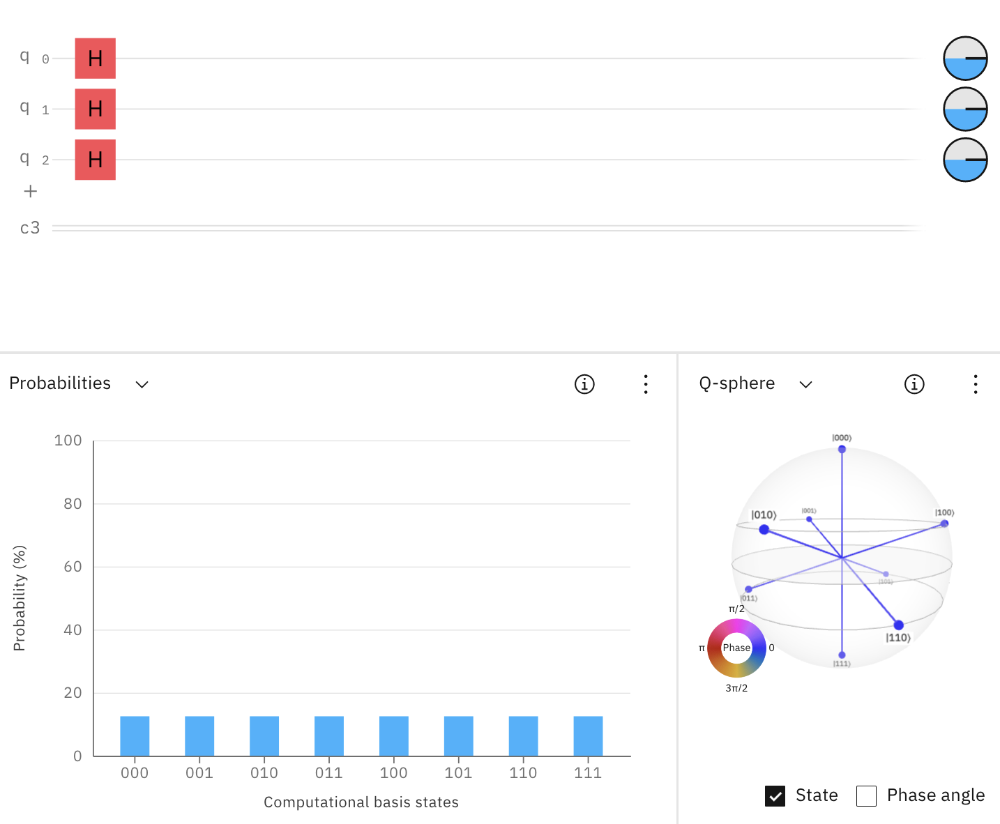

# Welcome to the Qoffee Maker 

## Introduction
Qoffee Maker is based on [Quantum Computing](http://ibm.com/quantum-computing) and will produce a coffee, capuccino, etc based on the measurement result of a Quantum Circuit.

To get your favorite type of beverage implies creating a quantum circuit whose measurement result is the appropriate representing binary number.

Sounds complicated?
Be assured it is neither. Have a look at the QuickStart and the examples below.

You can try out the examples on the [IBM Quantum Composer](http://quantum-computing.ibm.com/composer), before running it on the real Qoffee Maker. A short intro to the IBM Quantum Composer is available [here](Composer.md), a more detailed overview can be found [here](https://quantum-computing.ibm.com/composer/docs/iqx/overview).

Got your numbers correct? Great! Confirm your choice and enjoy.

## Beverages

Our Qoffee Maker offers eight beverages, which can be mapped to three-digit binary numbers with the canonical mapping 0 -> 000, 1 -> 001, 2 -> 010, ..., 6 -> 110, 7 -> 111.  

## How to obtain your coffee of choice
The following examples illustrate step-by-step how to use the standard gates to solve the Qoffee Puzzle.  
"Quantum Gates" are fundamental operations that applied to Qubits change their properties (state).
The three most important ones are: NOT, CNOT and H with a short description [here](Gates.md).
 For more details see the [Operations glossary](https://quantum-computing.ibm.com/composer/docs/iqx/operations_glossary).

### I want something to drink, it doesn’t matter what

Applying an H-Gate to all 3 Qubits brings the whole system into an equal superposition. Thus, the selection of your drink is entirely random.  
We hope you enjoy your quantum surprise :). 
 You can find a prebuilt version of the circuit [here](https://quantum-computing.ibm.com/composer/files/new?initial=N4IgdghgtgpiBcICSACA7hMAXFBnA9rFgBYCWYA5ilvigCYBO5A1gDQqk534y5iCYBDigQsWGA3TERIViACOEXFAQgA8gAUAogDkAigEEAygFkUAJgB0ABgDcAHTDkAxgBsArnRgo78mC9IARgCMFs4%2B9mAOcgwwVHIA2gDMALoRTjFUTkmpDg7EKAlWOWD5CUHFpfFmqTIgnrjppAAOWKT4YCogAL5AA). 

### I want a Cappucino

To request a Cappuccino (beverage number 4, encoded with the binary number 100), you need to build the Quantum Circuit such that the state (4, 100) will come up with 100% probability.  
 Remember: The order of qubits q2, q1, q0 is initialized at 0 each (0, 000).  
The simplest way to build the desired "Cappuccino circuit" is to apply a NOT-Gate to q2, which flips the state from |000> to |100>.  
Try this circuit [here](https://quantum-computing.ibm.com/composer/files/new?initial=N4IgdghgtgpiBcIDCEAOBXAxpglmA9iADQgCOEAzlAiAPIAKAogHICKAggMoCyABAEwA6AAwBuADpg8mADboAJjF7iyMGTgBGARkHSVEsJNIAnGAHNepANoBmALoHMpi5lsPJkgB6Wr-B8RBFCiccVAAXHHwwGhAAXyA), or see a [screenshot](Bilder/cappuccino.png).

### No caffein, please

Tea (0, 000) and Hot Chocolate (1, 001) are the only two drinks without caffein. 

To get one of these two drinks with equal probability, you can apply an H-Gate to q0.  
A superposition state of |0> and |1> is created using qubit q0, such that each state |000> and |001> have a 50% measurement probability.  
Try this circuit [here](https://quantum-computing.ibm.com/composer/files/new?initial=N4IgdghgtgpiBcIByB7ABAYwgM2zAlmADRoAOANjBAM5xEgCONUCIA8gAoCiSAigIIBlALJoATADoADAG4AOmEIZyAVwAmMNHMYxy%2BAEYBGCUu3ywChgCcYAczQMA2gGYAuuYw37GF%2B4UKACwdHKXcQeg1qT3xSABd8FDBWEABfIA), or see a [screenshot](Bilder/nothing.png).

### Similarly: I want something with caffein, but not too strong

To let the probabilistic measurement of the Quantum Circuit decide between Cappuccino (4, 100) and Latte Macchiato (5, 101), you can apply a NOT-Gate to q2 (flipping q2 to "1") and an H-Gate to q0.  
Try this circuit [here](https://quantum-computing.ibm.com/composer/files/new?initial=N4IgdghgtgpiBcICSACA7hMAXFBnA9rFgBYCWYA5uqSSgMYQBmjM5ANCgEYCuOY%2BOLPnx4sAJ3yUQbEAEcIuKAhAB5AAoBRAHIBFAIIBlALIoATADoADAG4AOmHJ0ANtwAmMFLbkwnpTgEZzRy87MHtZMRgqWQBtAGYAXVC6SKo6eKT7e2IUWMtMsAAPXJjTJOkQd1wU0gAHLFJJZRAAXyA), or see a [screenshot](Bilder/something2.png).

### I want tea or coffee

To get either a Tea (0, 000) or Coffee (3, 011) with equal likelihood, the so-called "Bell State" can be used. It is created by applying an H-Gate to q0 and a CNOT-Gate with q1 as target and q0 as control qubit.  
"Bell States" are exemplary in Quantum Computing as they display entanglement.  
Try this circuit [here](https://quantum-computing.ibm.com/composer/files/new?initial=N4IgdghgtgpiBcICSACA7hMAXFMCWWAFjAE4pYwQoD2ZAxtQGaMxwA0IAjhAM5QIgA8gAUAogDkAigEEAygFkUAJgB0ABgDcAHTB4wdADYBXACYwUWrjAN4ARgEYVeupe1gdnEjADmKTgG0AZgBdNzovXzog0J0dQj9-NRj9AA8EpLYA%2B1CQDjMecLwAByw8ajABEABfIA), or see a [screenshot](Bilder/tea.png).

## Advanced Exercises

To spice up your beverage selection, you can try to find quantum circuits that solve the [advanced exercises](Advanced-exercises.md).  
We provide examples for the first few, but these are not the only possible approach. Give it a shot yourself and explore alternative Circuit options or come up with individual Quoffe solutions.

## How to build your own Qoffee Maker at home
Before jumping into more challenging Circuits, beware: 
The entire code of this project is available in this GitHub repo. Code cleanup will follow as well as documentation.  
You can use the [IBM Quantum Composer](http://quantum-computing.ibm.com/composer) any time to practice your Quantum Skills by using fundamental quantum gates and executing quantum circuits on real quantum computers.
