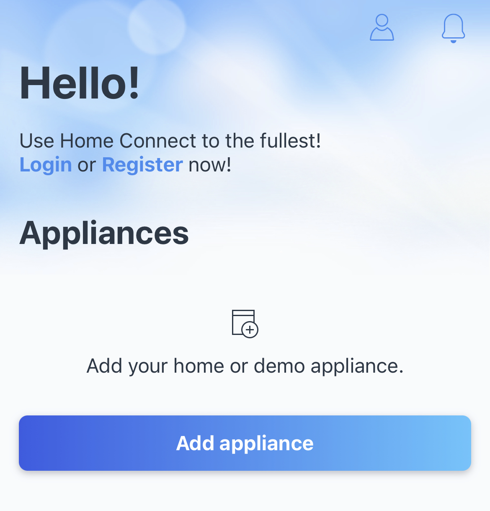
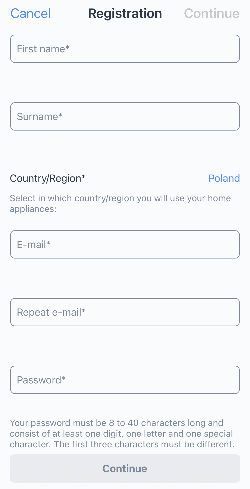

# Qoffee-Maker

## User Instructions

Find user instructions on the project GitHub pages: http://qoffee-maker.org

## Installation

As an example, we will install the Qoffee Maker Graphical User Interface (GUI) to be accessed under `https://localhost:8887`. It is also possible to choose another URL that you want to access the GUI from.
### Prerequisites

- Home Connect enabled coffee machine
- Android Phone or iPhone
- Computer
- Email address you will use to register with Home Connect

### Install Home Connect
1. Install the Home Connect [iOS App](https://app.adjust.com/gdi5c03?campaign=germany&redirect_macos=https%3A%2F%2Fapps.apple.com%2Fde%2Fapp%2Fhome-connect-app%2Fid901397789&redirect_windows=https%3A%2F%2Fapps.apple.com%2Fde%2Fapp%2Fhome-connect-app%2Fid901397789) or [Android App](https://app.adjust.com/gdi5c03?campaign=germany&redirect_macos=https%3A%2F%2Fplay.google.com%2Fstore%2Fapps%2Fdetails%3Fid%3Dcom.bshg.homeconnect.android.release%26hl%3Dde&redirect_windows=https%3A%2F%2Fplay.google.com%2Fstore%2Fapps%2Fdetails%3Fid%3Dcom.bshg.homeconnect.android.release%26hl%3Dde)

2. In the App Connect mobile app, you need to sign in with a Home Connect User Account.

After starting the app, on the welcome screen will show the option to log in to the app or register a new user.

If you have not used the "Home Connect" app before follow these steps on how to create an account:

- Click on the Register link as shown in the picture below.

- Use your email address to register new user. Provide a new password as requested on the form:

- Then, press "Continue" link on the top-right corner.

- Read "Terms and Condition" rules, and accept it by checking "I have read and accept the terms of use" checkbox, then press "Continue" button.

- Once again, read "Data protection statement" and accept it by checking "I have read and accept the data protection statement" checkbox. Press "Continue" button to proceed.

- Read the statements regarding collecting user data and accept it by clicking "I consent to the collection of mu user data" checkbox. Press "Continue" button to finish procedure.

- Review the provided information and click "Send" button.

- Now, you have to activate the registered account. To confirm the account you must click the link in the activation email that you will receive in your mailbox.

- Now, you confirm your email address, your account will be activated and you can log in to the Home Connect app using your newly registered user.

3. Add your Coffee Machine appliance to the Home Connect App

You can connect your Coffee Machine under _Appliances_ in the App.

4. [Sign up for a Home Connect Developer Account](https://developer.home-connect.com/user/register)

Make sure to set your _Default Home Connect User Account for Testing_ to the Home Connect User Account (mail address) used in the previous step.

Hint: It is not crucial to provide meaningful _Additional Information_.

5. [Register a new Home Connect Appliance](https://developer.home-connect.com/applications/add)

Set an _Application ID_ of your choice. Using localhost, the _Redirect URI_ is set to `http://localhost:8887/auth/callback`. Keep the default settings for the remaining boxes and create the appliance.

### Install the Qoffee Maker GUI
Install the Qoffee Maker GUI in three steps:

1. Create a `.env` file with the following variables:
    - `HOMECONNECT_API_URL`: `https://api.home-connect.com/` (Home Connect API) or `https://simulator.home-connect.com/` (simulator API)
    - `HOMECONNECT_CLIENT_ID`: Client ID of the Home Connect Appliance
    - `HOMECONNECT_CLIENT_SECRET`: Client Secret of the Home Connect Appliance
    - `HOMECONNECT_REDIRECT_URL`: Callback URL for HomeConnect as registered in your application in HomeConnect. On localhost this is `http://localhost:8887/auth/callback` (the port is determined by Jupyter, `/auth/callback` is fixed)
    - `DEVICE_HA_ID`: This is the HomeConnect Appliance ID (HA ID) of your coffee machine. It is useful when you have mulHintle coffee machines registered in your Home Connect App. Leave it blank if you don't want to set it/don't know about it.
      - To get the HA IDs of your available machines start the QoffeeMaker, authenticate and then, type http://{YOUR_IP_ADRESS}:8887/machines into your browser. You will get an response with all your appliances and HA IDs.
    - `IBMQ_API_KEY`: the API Key for [IBM Quantum](https://quantum-computing.ibm.com/account)

2. Run the container image with the specified environment variables: `docker run --name qoffee --rm -itp 8887:8887 --env-file .env ghcr.io/janlahmann/qoffee-maker`

3. Now you can start using the Qoffee Maker GUI under http://localhost:8887 (the login token is shown in the StdOut of the docker container). After logging in to Jupyter, you have to select _qoffee.ipynb_ and then you have to click the rocket icon to _Activate App Mode_.

Enjoy your Quantum Coffee. ☕️

## Installation on RasQberry (draft):

Installation and startup of Qoffee-Maker has been fully integrated to the RasQberry automated setup. (Currently in branch "dev8", but will be merged to master soon.)

In rasqberry-config (started with `$ . ./RasQ-init.sh dev9`), use the following menu items in "D Quantum Demos" to run the locally build docker image or the image available on dockerhub: "QM Qoffee-Maker", "QMd Qoffee-Maker".

To trigger a rebuild, choose "A Advanced Config" -> "QMrb Qoffee-Maker rebuild".

To stop all qoffee containers, select "A Advanced Config" -> "QMst stop Qoffee-Maker".

The two versions of the demo can also be started using the "Qoffee Maker" desktop icons.

