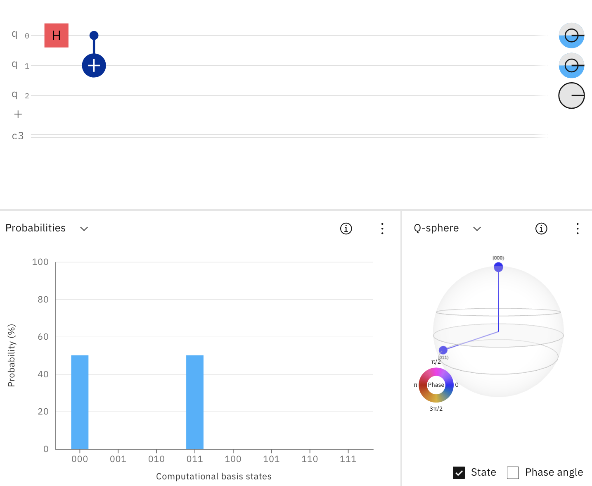
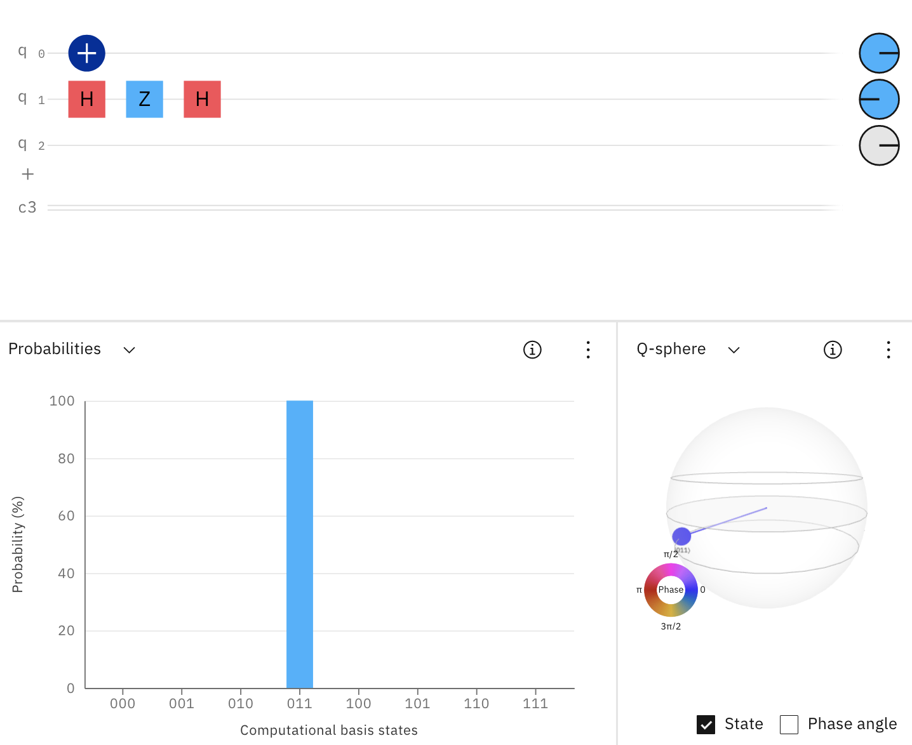

# Welcome to the Qoffee Maker 

## Introduction
Qoffee Maker is based on [Quantum Computing](https://en.wikipedia.org/wiki/Quantum_computing) and will produce a coffee, capuccino, etc based on the measurement result of a Quantum Circuit. 

All you need to do to get your favourite type of coffee is to graphically create a quantum circuit whose measurement result is the binary number of your beverage.

Sounds complicated?  
... Actually it's quite simple. Have at look at the Quick Start and the examples below.

You can try out the examples on the [IBM Quantum Composer](http://quantum-computing.ibm.com/composer), before running it on the real Qoffee Maker.

## Quick Start

### IBM Quantum Composer

Using the IBM Quantum Composer, Quantum Circuits can be build by drag & drop of various gates onto the qubits. The resulting measurement probabilities are shown in a diagram. In addition, the Quantum Circuits can be executed on real quantum hardware or on simulators. A more detailed overview of the IBM Quantum Composer can be fond [here](https://quantum-computing.ibm.com/composer/docs/iqx/overview).

 

2 View: customize the layout.

4 Quantum gates and operations bar: Drag and drop gates (i.e. the building blocks of quantum circuits) onto the graphical circuit editor.

6 Graphical circuit editor: this is where you build a circuit. Drag gates and other operations onto the horizontal qubit “wires” that make up your quantum register.

8 Visualizations: characterize your circuit, e.g. visualize the probabilities of the quantum state as you build it.

### Beverages

Our Qoffee Maker offers eight beverages, which can be mapped to three-digit binary numbers with the canonical mapping 0 -> 000, 1 -> 001, 2 -> 010, ..., 6 -> 110, 7 -> 111. 

## Description of the Quantum Gates
"Quantum Gates" are the fundamental operations that can be applied to Qubits.

The three most important Quantum gates are:

For more details see [Operations glossary](https://quantum-computing.ibm.com/composer/docs/iqx/operations_glossary)

## How to select your coffee of choice

### I want a Cappucino

Goal: 

Cappuccino = No. 4 = State 100

To make sure to certainly get a cappuccino, we need to build the Quantum Circuit such that the state 100 will come up with 100% probability.

The easiest way to do that is to apply an NOT-Gate (Pauli-X-Gate) on the Qubit q2.

 

### I want nothing with caffein

Goal: 

Tea = No. 0 = State 000 or 

Hot Chocolate = No. 1 = State 001
Tea and Hot Chocolate are the only two drinks without caffein. 

To get each drink with an equal probability, we need to apply an H-Gate to q0. This brings our qubit into a superposition between 0 and 1, such that each state 000 and 001 have a 50% probability to result after the measuring, where the superposition collapses.

### I want something to drink, it doesn’t matter what

Goal: every drink = every State

Applying an H-Gate to all 3 Qubits, brings the whole system into a superposition. As shown in the diagram, the probability for each state to result is the same. Thus the selection of your drink is completely left to chance. 

We hope you enjoy your quantum surprise :)

### I want something with caffein, but not too strong
Goal: Cappuccino = No. 4 = State 100 or Latte Macchiato = No. 5 = State 101

Letting our Quantum Computer decide between Cappuccino and Latte Macchiato, we need to make sure either the state 100 or 101 will result after the measurement. Therefore, applying a NOT-Gate to q2 ensures the 1 in the first place of each state. Similarly does an H-Gate applied to q0 for the superposition of 0 and 1 in the third place of the state.

### I want either tea or coffee (Bell State)

Goal: Tea = No. 0 = State 000 or Coffee = No. 3 = State 011

To get either a tea or coffee with equal probability a special state, the so-called „Bell State”, can be used. By applying an H-Gate to q0 a superposition for the last digit of the resulting state is set up. 

Applying then a CNOT-Gate to q1 as target and q0 as control qubit, it ensures q1 will flip its base state only, when q0 is 1. Thus only 000 or 011 can result after measurement.

## Advanced Exercises (optional)

### I want an Espresso, but I can apply all single qubit gates to q0 only

Goal: Espresso = No. 2 = State 010

Getting a certain drink, in this case an Espresso, can also be done by applying several CNOT-Gates as it’s shown in the circuit below (on the right/left…)

### I want a normal coffee, but I can use only one single X-Gate, plus the other gates as needed

Goal: Coffee = No. 3 = State 011

To certainly get a normal coffee, we need to switch the states of both q0 and q1. This can be done easily by applying NOT-Gates like for q0.

 But we can also go a more quantum-computational way using two Hadamard-Gates and a Z-Gate in between. As you can see, bringing a qubit into an equal superposition (first H-Gate), modifying it by turning its vector around the Z-axis (Z-Gate), and reversing the superposition (second H-Gate), turns out to be the same as applying a simple NOT-Gate.

  

### I want a tea or something strong, but I prefer tea

Goal: 

Tea = No. 0 = State 000 or 

Espresso = No. 2 = State 010 or 

Coffee = No. 3 = State 011 or 

Wiener Melange = No. 6 = State 110 or 

Americano = No. 7 = State 111, but Tea with a higher probability

### I want something strong, but preferably an Espresso

Goal: 

Espresso = No. 2 = State 010 or Wiener Melange = No. 6 = State 110 or Americano = No. 7 = State 111, Probability for an Espresso should be higher than for Wiener Melange and Americano

### I want something with caffein
Goal: 

Espresso = No. 2 = State 010 or 

Coffee = No. 3 = State 011 or 

Cappuccino = No. 4 = State 100 or 

Latte Macchiato = No. 5 = State 101 or 

Wiener Melange = No. 6 = State 110 or 

Americano = No. 7 = State 111

### I want either something without caffein or something with much caffein but without milk (CCX Gate)

Goal: 

Tea = No. 0 = State 000 or 

Hot Chocolate = No. 1 = State 001 or 

Espresso = No. 2 = State 010 or 

Americano = No. 7 = State 111

### I want something to drink, it doesn’t matter what, preferably a Coffee and no Americano

Goal: 

Tea = No. 0 = State 000 or 

Hot Chocolate = No. 1 = State 001 or 

Espresso = No. 2 = State 010 or 

Coffee = No. 3 = State 011 or 

Cappuccino = No. 4 = State 100 or 

Latte Macchiato = No. 5 = State 101 or 

Wiener Melange = No. 6 = State 110, Coffee should have the highest probability

## How to build your own Qoffee Maker at home
... ???

