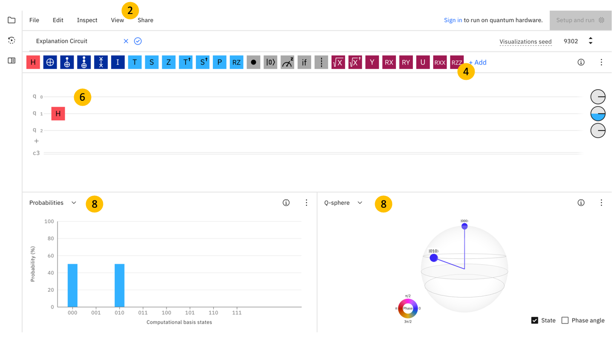
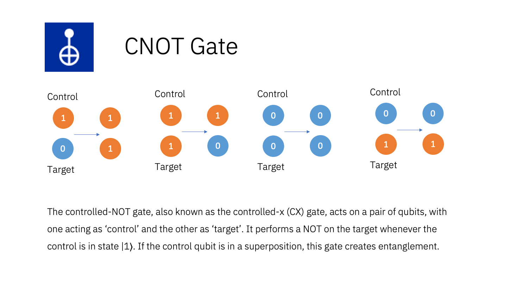
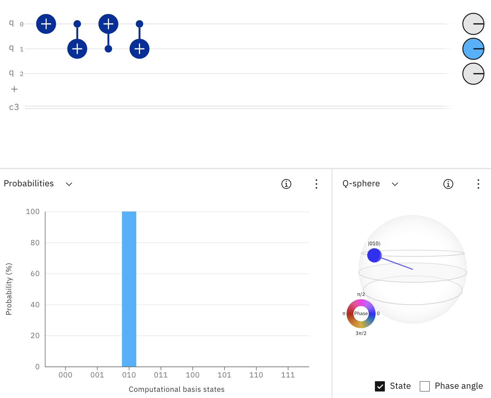

# Welcome to the Qoffee Maker

## Introduction
Qoffee Maker is based on [Quantum Computing](https://en.wikipedia.org/wiki/Quantum_computing) and will produce a coffee, capuccino, etc based on the measurement result of a Quantum Circuit. All you need to do to get your favourite type of coffee is to graphically create a quantum circuit whose measurement result is the binary number of your beverage.

Sounds complicated? ... Actually it's quite simple. Have at look at the instruction and the examples.
You can try ouut the examples on the [IBM Quantum Composer](http://quantum-computing.ibm.com/composer), before running it on the real Qoffee Maker.

## Quick Start

To get started, you first need to decide whether you begin from scratch or with a pre-built circuit.
For the next step you’re going to use our IBM Quantum Composer. This program allows building Quantum Circuits easily by just dragging and dropping different gates onto the qubits. Giving you the probability of each state, the diagram in the lower left may help creating the circuit for the drink you wish.
Once your done with your circuit, you can submit it and via the IBM Cloud it will be sent to an IBM Quantum Device. After running, the result will be sent back to the Qoffee Maker, where you can get your drink, if you agree with the Quantum choice.
Our Qoffee Maker offers the following 8 beverages, which is why we need three qubits, named q0, q1 and q2, to get the binary numbers. While building your circuit, please remember, the first qubit (q0) belongs to the last digit of the binary number and the third qubit (q2) belongs to the first digit.

## Description of the Quantum Gates
"Quantum Gates" are the fundamental operations that can be applied to Qubits - which quantum computuers are based on. In the following Screenshots we're showing at first the Quantum Composer which is a graphical quantum programming tool that lets you drag and drop operations to build quantum circuits and run them on real quantum hardware or simulators.

 

Here we listet some of the Quantum gates:

For more details see in [Operations glossary](https://quantum-computing.ibm.com/composer/docs/iqx/operations_glossary)

### … a Cappucino
Goal: Cappuccino = No. 4 = State 100
To make sure to certainly get a cappuccino, we need to build the Quantum Circuit such that the state 100 will come up with 100% probability.
The easiest way to do that is to apply an NOT-Gate (Pauli-X-Gate) on the Qubit q2.

 

### … nothing with caffein
Goal: Tea = No. 0 = State 000 or Hot Chocolate = No. 1 = State 001
Tea and Hot Chocolate are the only two drinks without caffein. To get each drink with an equal probability, we need to apply an H-Gate to q0. This brings our qubit into a superposition between 0 and 1, such that each state 000 and 001 have a 50% probability to result after the measuring, where the superposition collapses.

### … something to drink, it doesn’t matter what
Goal: every drink = every State
Applying an H-Gate to all 3 Qubits, brings the whole system into a superposition. As shown in the diagram, the probability for each state to result is the same. Thus the selection of your drink is completely left to chance. We hope you enjoy your quantum surprise :)

### … something with caffein, but not too strong
Goal: Cappuccino = No. 4 = State 100 or Latte Macchiato = No. 5 = State 101
Letting our Quantum Computer decide between Cappuccino and Latte Macchiato, we need to make sure either the state 100 or 101 will result after the measurement. Therefore, applying a NOT-Gate to q2 ensures the 1 in the first place of each state. Similarly does an H-Gate applied to q0 for the superposition of 0 and 1 in the third place of the state.

### … either tea or coffee (Bell State)
Goal: Tea = No. 0 = State 000 or Coffee = No. 3 = State 011
To get either a tea or coffee with equal probability a special state, the so-called „Bell State”, can be used. By applying an H-Gate to q0 a superposition for the last digit of the resulting state is set up. Applying then a CNOT-Gate to q1 as target and q0 as control qubit, it ensures q1 will flip its base state only, when q0 is 1. Thus only 000 or 011 can result after measurement.

### … an Espresso
Goal: Espresso = No. 2 = State 010
Getting a certain drink, in this case an Espresso, can also be done by applying several CNOT-Gates as it’s shown in the circuit below (on the right/left…)

### … a normal coffee
Goal: Coffee = No. 3 = State 011
To certainly get a normal coffee, we need to switch the states of both q0 and q1. This can be done easily by applying NOT-Gates like for q0. But we can also go a more quantum-computational way using two Hadamard-Gates and a Z-Gate in between. As you can see, bringing a qubit into an equal superposition (first H-Gate), modifying it by turning its vector around the Z-axis (Z-Gate), and reversing the superposition (second H-Gate), turns out to be the same as applying a simple NOT-Gate.

## Advanced (optional)

## I want…

### … a tea or something strong, but I prefer tea

Goal: Tea = No. 0 = State 000 or Espresso = No. 2 = State 010 or Coffee = No. 3 = State 011 or Wiener Melange = No. 6 = State 110 or Americano = No. 7 = State 111, but Tea with a higher probability

### … something strong, but preferably an Espresso

Goal: Espresso = No. 2 = State 010 or Wiener Melange = No. 6 = State 110 or Americano = No. 7 = State 111, Probability for an Espresso should be higher than for Wiener Melange and Americano

### … something with caffein
Goal: Espresso = No. 2 = State 010 or Coffee = No. 3 = State 011 or Cappuccino = No. 4 = State 100 or Latte Macchiato = No. 5 = State 101 or Wiener Melange = No. 6 = State 110 or Americano = No. 7 = State 111

### … either something without caffein or something with much caffein but without milk (CCX Gate)

Goal: Tea = No. 0 = State 000 or Hot Chocolate = No. 1 = State 001 or Espresso = No. 2 = State 010 or Americano = No. 7 = State 111

### … something to drink, it doesn’t matter what, preferably a Coffee and no Americano

Goal: Tea = No. 0 = State 000 or Hot Chocolate = No. 1 = State 001 or Espresso = No. 2 = State 010 or Coffee = No. 3 = State 011 or Cappuccino = No. 4 = State 100 or Latte Macchiato = No. 5 = State 101 or Wiener Melange = No. 6 = State 110, Coffee should have the highest probability

## How to build your own Qoffee Maker at home
... ???

